# SmartAdvisorMT5

Advisory application for analyzing financial markets that provides 
clear transaction signals based on expert systems, data aggregation methods 
and fuzzy logic. Historical financial data used by the application comes from 
the MetaTrader 5 trading platform.

# Table of content

- [Used technologies and applications](#used-technologies-and-applications)
- [Project setup](#project-setup)
- [Application appearance](#application-appearance)
- [Manual](#manual)
- [Project status](#project-status)

# Used technologies and applications

1. Programing language:
    - Python 3.12


2. Main libraries:
    - PyQt6 - used to create a graphical interface.
    - NumPy - used for numerical calculations and optimization.
    - Pandas - used to work with stock market data.
    - Matplotlib - used to create static charts.
    - Plotly - used to create an interactive candlestick chart.
    - SQLite3 - used to work with the database.
    - Argon2 - used to hash passwords in the database.
    - PyOTP - used to generate one-time identification codes.


3. Used programs:
    - Qt Designer - program was used when creating the graphical interface.
    - GIMP - program used to create application graphics.
    - DB Browser - program used when working with the database.
    - Google Authenticator - program used to store two-factor login keys.
    - MetaTrader 5 - investment platform used to download data and open trading positions.

# Project setup

1. Download and install interpreter for `Python 3.12` from: `https://www.python.org/downloads/`.

2. Clone git repository using following command:

```bash
  https://github.com/gabrielkomor/SmartAdvisorMT5.git
```

3. Enter into `.\SmartAdvisorMT5\` directory.

4. Create virtual environment for Python using command below:

```bash
  py -3.12 -m venv .venv
```

5. Install required libraries (after virtual venv activation):

```bash
  pip install -r .\requirements.txt
```

6. Run application:

```bash
  python main.py
```

or

- Using IDE (for PyCharm you can use `Shift + F10` keyboard shortcut)

## Tips

- If you want to run only the main application window without logging in first, 
uncomment the following line in the main.py file: `run_app()`.


- If you want to run the entire application, including its login system, 
uncomment the following program line in the main.py file: `run_main()`. Additionally, 
this operation requires the correct creation of an environment file, instructions on how to do it correctly are below:

### How to correctly fill environment file:

1. Create `.env` file in `.\SmartAdvisorMT5` directory next to `./env-example` file.
2. Copy the contents of the file `.env-example` into `.env` file.
3. Replace the sample values with real data.

# Application appearance

### Contents of the tabs of the main application window

- Main application window containing the window for downloading historical stock market data:
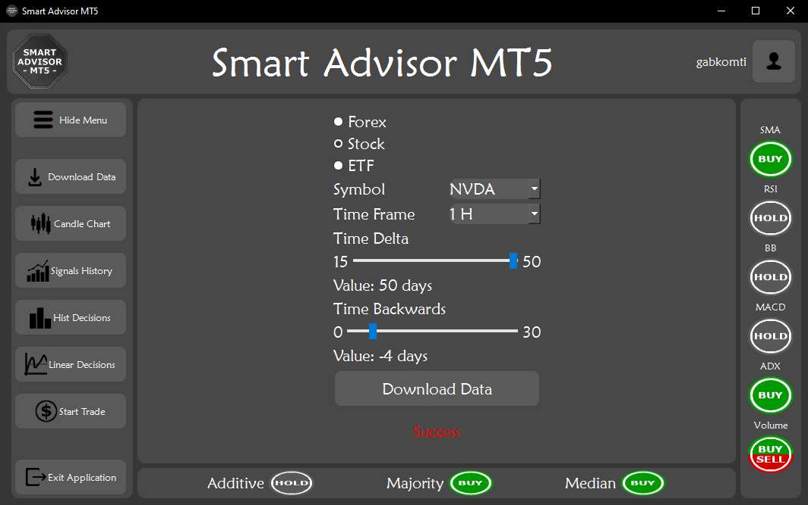


- Main application window showing an interactive candlestick chart created based on previously downloaded data:
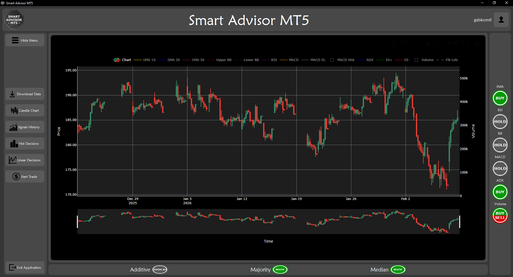


- Main application window showing signals transmitted by applications in the past:
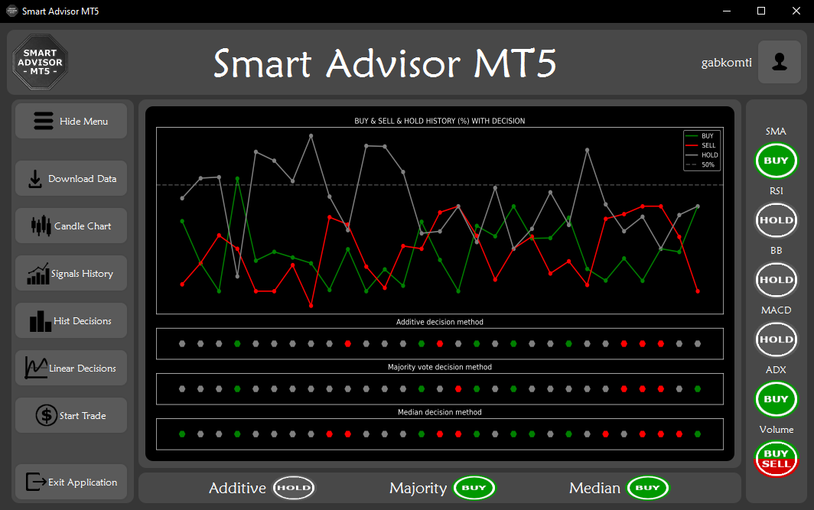


- Main application window showing the percentage values of the signal strength transmitted by all expert systems:
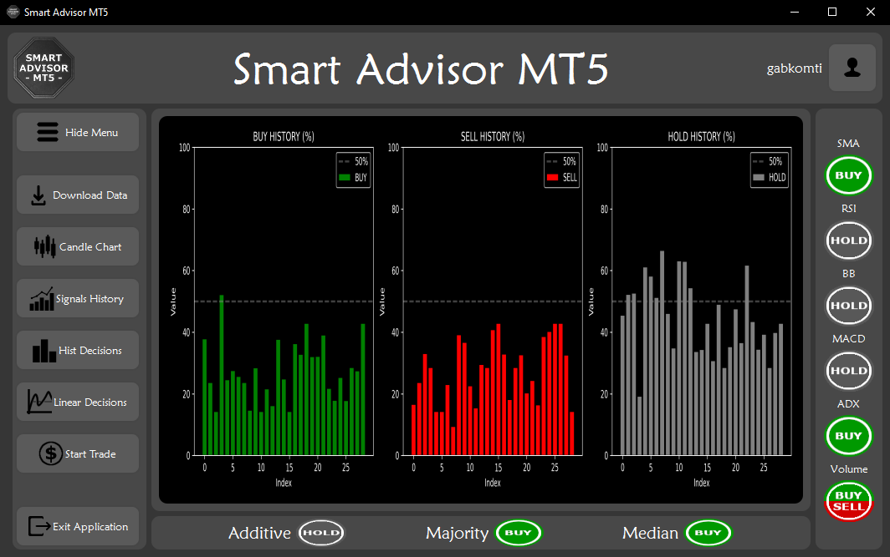


- The same data shown in a line graph:
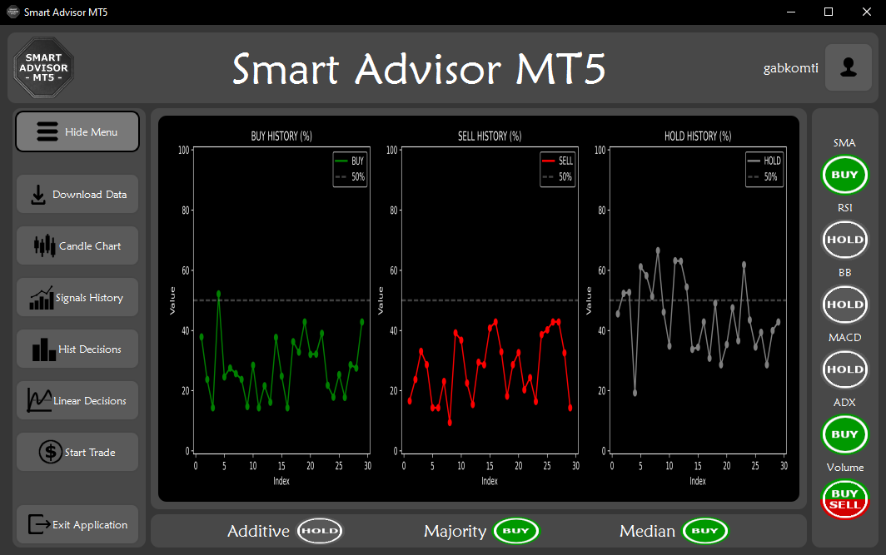


- Main application window responsible for making transactions in the MetaTrader 5 platform from the application 
level and displaying currently open trading accounts:
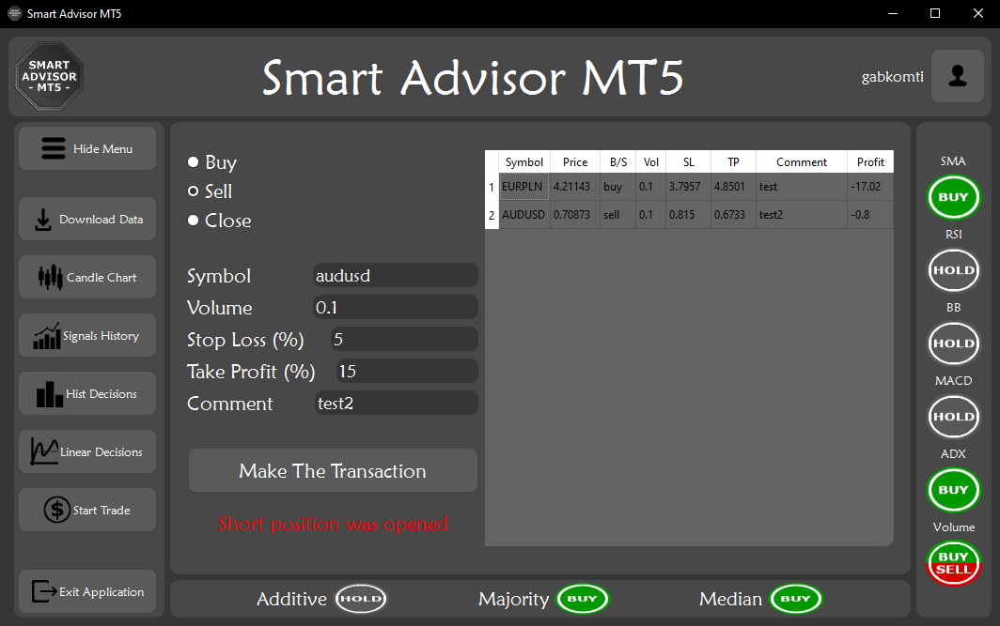


- Main application window showing the details of the created account:
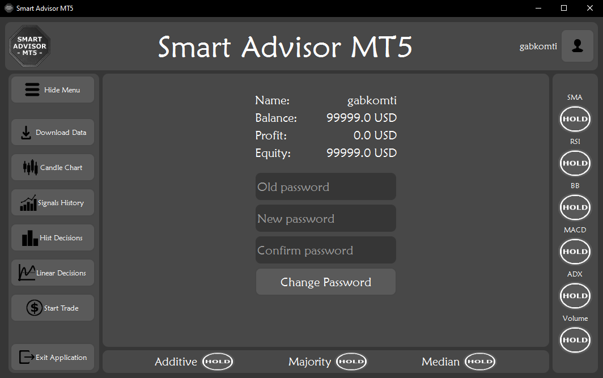


### Implemented technical indicators 
##### (they can be displayed on the application graph for currently downloaded data)


- SMA (Simple Moving Average) indicator:
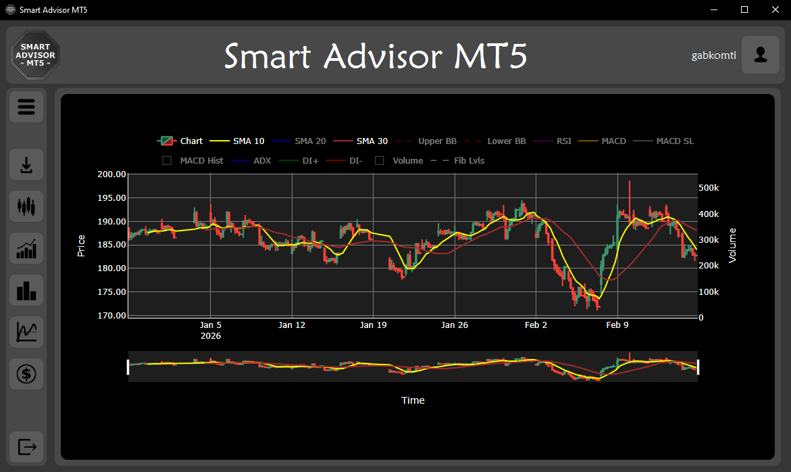


- RSI (Relative Strength Index) indicator:
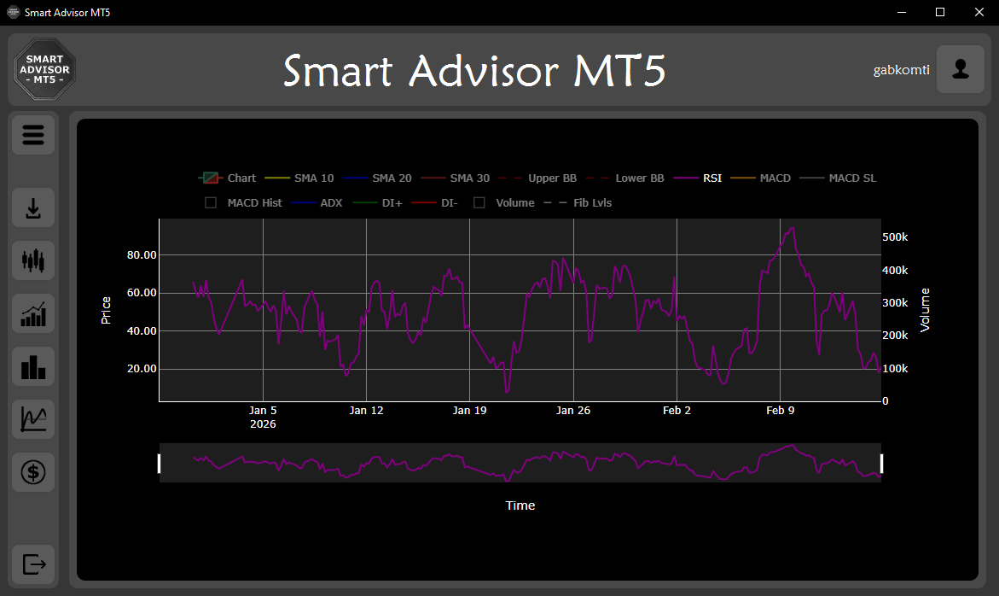


- BB (Bollinger Bands) indicator:
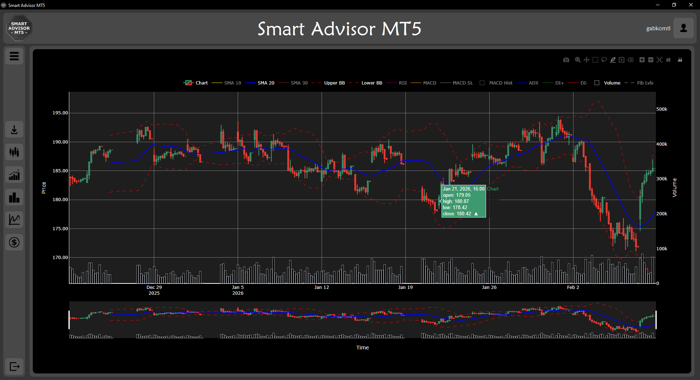


- MACD (Moving Average Convergence/Divergence) indicator:
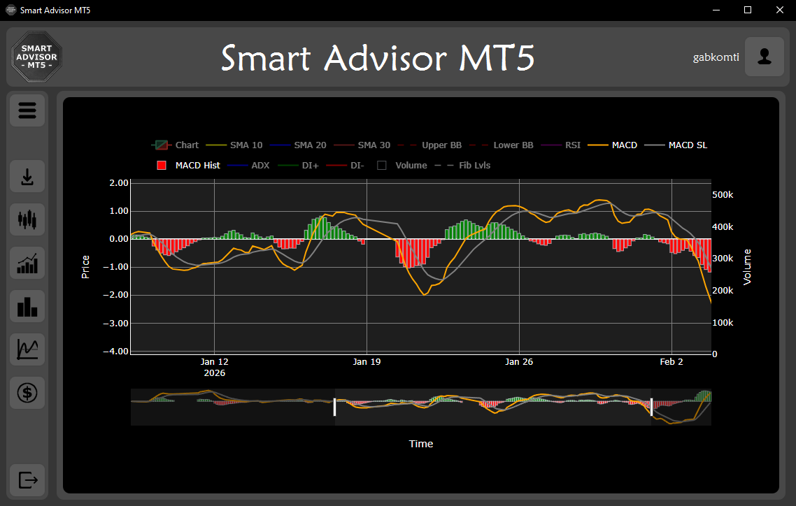


- ADX (Average Directional Index) indicator:


- Volume:
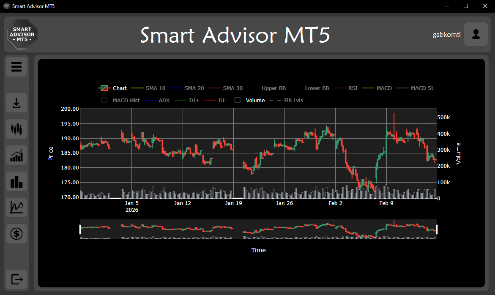


- Fibonacci Levels:
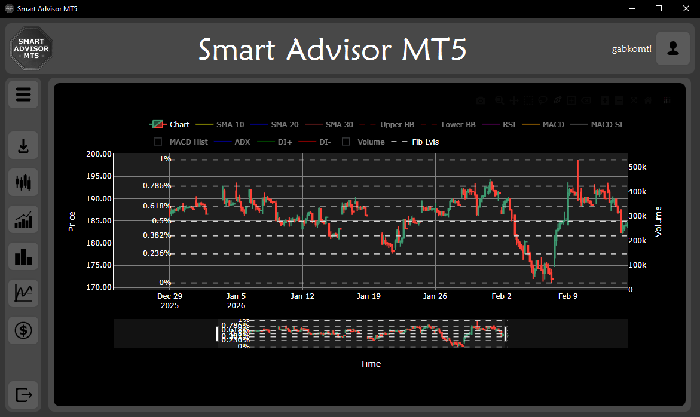


- The technical indicators presented above have been implemented in the 
application's automated expert system and provide the user with the 
current trading signal via a graphical interface. Their display is 
intended to enable the user to perform manual technical analysis 
according to their needs.

# Manual

- The following instructions describe how to run the application with a full 
login system and how to create a user account in it.

1. Launch the Metatrader 5 investment platform.
2. Create an investment account there (a demo account is enough).
3. Enable the possibility of making investment transactions on the platform by external programs by clicking 
the button attached in the graphic below:

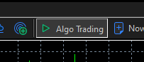

4. Run the applications according to the instructions described here: [Project setup](#project-setup).
5. Create an account in the application by selecting the `Sing in` button in the window below 
(if you have an account in the application, go to this step: 10)

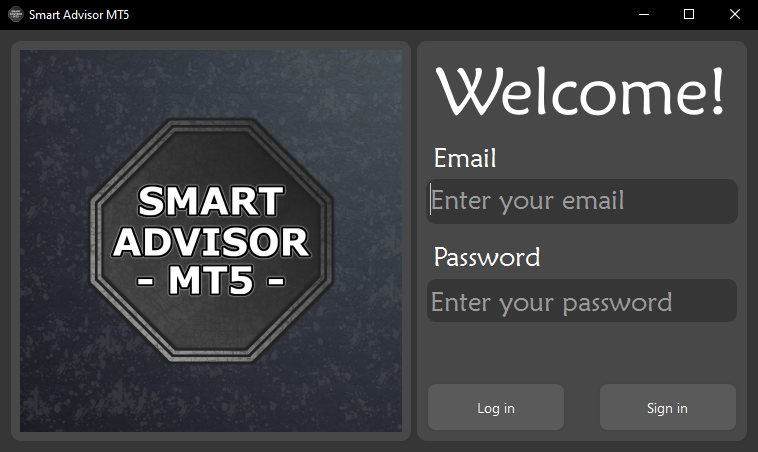

6. Then enter your email address and create a password:

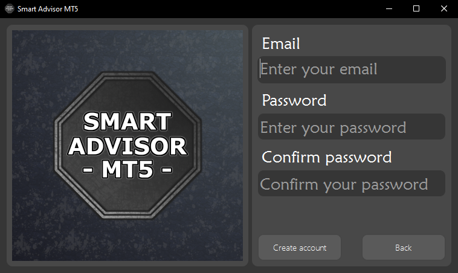

7. Verify the provided e-mail address by entering the code that was sent to it by the application:

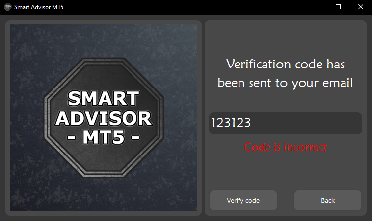

8. Launch the external Google Authenticator app to add your app account there.
9. Add two-factor login method by scanning the QR code or entering the code:

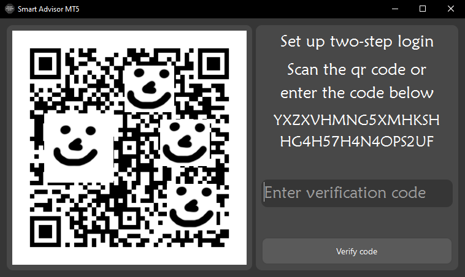

10. Log in to the application using the account you created.
11. Enter your two-factor login code from the Google Authenticator app:

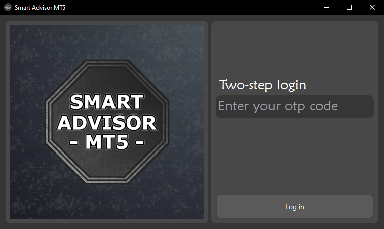

12. Log in to the MetaTrader 5 trading platform from the advisor application:


13. To download the data of the company we are interested in, it must first be added as a trading symbol in MetaTrader 5.
14. Go to the `Download Data` tab, select the historical trading data you are interested in and download it.
15. After downloading the data, the application will automatically generate charts and trading signals visible in 
the program's graphical interface.

### Tips

- The application also allows you to draw on a candlestick chart and change its size depending on the user's needs, 
the graphical interface is responsive.

# Project status

- The Smart Advisor MT5 application is a fully functional and completed program supporting technical analysis of the stock market.
- I used it as the basis for my engineering thesis, titled "An Advisory Application for Financial Market Analysis Using MetaTrader 5".
- In the future, I plan to create another version of this application, 
one with more advanced analytical features. I plan to use other programming languages to build the application. 
Expanding the functionality of this application will form the basis of my future master's thesis.